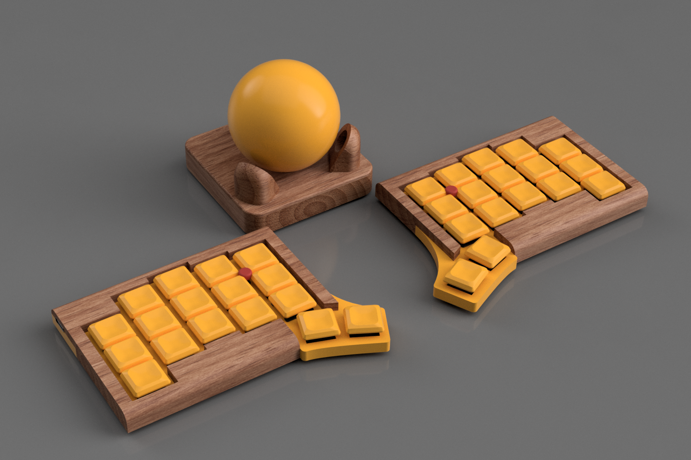
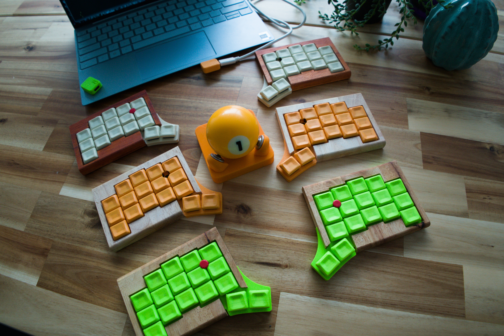

#+TITLE: Atlas Keyboard
#+OPTIONS: toc:nil num:nil

[[keymapdrawer-nix/keymap.svg]]

* Atlas
34-key split ergonomic keyboard with dual TrackPoints and BLE wireless (no dongle).

- Choc V1 hotswap switches
- XIAO BLE (nRF52840) controllers
- Sprintek all-in-one TrackPoint modules on both halves
- ZMK firmware, BLE split — no dongle needed

** Status (Mar 2026)
- BLE split working — direct host connection, no dongle
- Left TrackPoint working (Sprintek AIO, PS/2 via UART)
- Right TrackPoint wired, testing in progress
- Mouse layer auto-activates on trackpoint movement
- Scroll mode on thumb key hold
- PCBs: prototype fabricated, iterating
- Case: wooden prototype

** Architecture
#+begin_example
Host <--BLE-- Left (central + trackpoint) <--BLE-- Right (peripheral + trackpoint)
#+end_example

** Mouse Layer
When moving trackpoint, the mouse layer auto-activates for 1 second after last movement.

#+begin_example
Thumb keys:
| SCROLL | LCLK | LCLK | RCLK |
#+end_example

- *Scroll*: Hold to convert movement to scroll wheel

** Hardware
- TrackPoint: Sprintek all-in-one module, PS/2 via UART
- Pins: D6 (SCL), D7 (SDA), P0.09 (reset)
- Both sides use identical wiring
- Controller: Seeed XIAO nRF52840 (BLE)

** Build
#+begin_src bash
nix develop
just all      # build both sides
just left     # build left only
just right    # build right only
just keymap   # generate keymap SVG
#+end_src

Firmware outputs to =firmware/out/=.

PCB generation pipeline is documented in =tools/readme.org=.

** Repo Structure
#+begin_example
justfile             build commands (firmware + PCB)
flake.nix            nix dev environment
pcb/                 KiCad projects (main + trackball sensor)
stl/                 3D-printable case parts
tools/               PCB generation pipeline (see tools/readme.org)
firmware/            ZMK workspace (shields, keymap, config)
nix/                 nix package defs, keymap drawer
images/              project photos + renders
#+end_example
