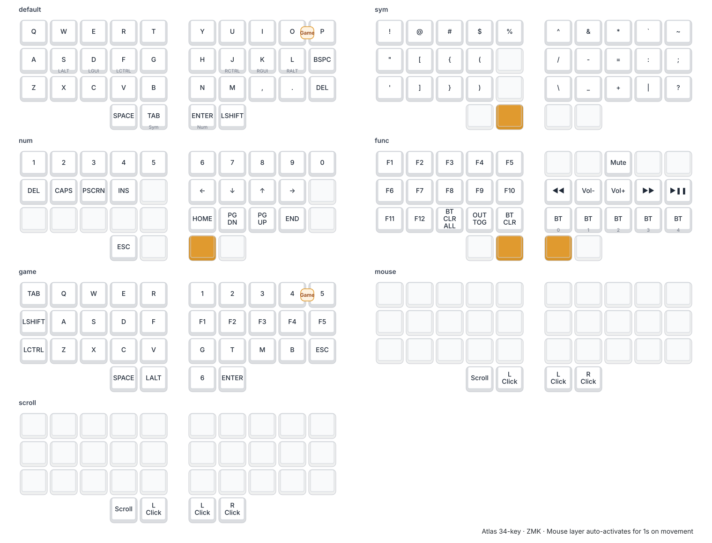

#+title: Atlas
#+options: toc:nil num:nil

[[file:images/atlas.jpg]]

* Atlas

34-key split ergonomic keyboard with trackpoint. Per-half XIAO nRF52840
Plus, BLE split, ZMK firmware.

** Status (June 2026)

- Daily driver: breakout-board prototype, Sprintek AIO trackpoint on the
  left half. Pinned at the =proto/breakout-v1= tag.
- Next board: ergogen-driven KiCad layout under =pcb/=, 34 keys (5×3
  alphas + 2 thumbs per half), Choc V2 hotswap.
- ADS1220 strain-gauge trackpoint: firmware bench-proven (HID mouse,
  radial deadzone, click-to-wake via input-processor-ping) — pinned at
  =bench/ads1220=. Currently being hand-laid into the PCB.

** Architecture

#+begin_example
Host <--BLE-- Left (central + trackpoint) <--BLE-- Right (peripheral)
#+end_example

** Mouse layer

When the trackpoint moves, the mouse layer auto-activates for ~1 s after
the last movement.

#+begin_example
Thumb keys: | SCROLL | LCLK | LCLK | RCLK |
#+end_example

** Parts

| Choc V1/V2 hotswap     | =C5333465= | Extended                                   |
| SK6812MINI-E rev-mount | =C5149201= | Extended                                   |
| 1N4148W SOD-123 diode  | =C81598=   | Basic                                      |
| XIAO nRF52840 Plus     | DNP        | Hand-solder; one per half                  |
| ADS1220 (TSSOP-16)     | =C40103=   | Strain-gauge ADC for trackpoint, integrating now |
| Sprintek SK8707-PT     | DNP        | AIO trackpoint (used in current prototype) |

** Previous work

- =proto/breakout-v1= — breakout-board prototype (daily driver). KiCad
  PCB + hand-wired XIAO breakouts.
- =bench/ads1220= — ADS1220 strain-gauge ADC firmware, bench-proven,
  not yet boarded.

** Links

- [[https://thock.mwlabs.be][thock.mwlabs.be]] — audition Choc switches:
  hear each one with a simulated typist and hot-swap on the fly.
  Background + vote for the group-buy favourite:
  [[https://mwlabs.be/lab-journal/introducing-thock/][Introducing Thock]].
- [[https://mwlabs.be][mwlabs.be]] — mwlabs.
