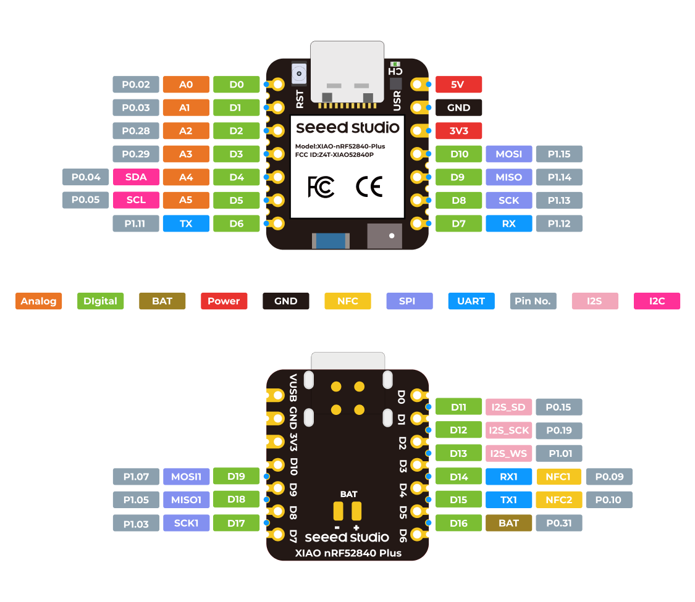

#+TITLE: Atlas Keyboard
#+OPTIONS: toc:nil num:nil

[[images/atlas-render.png]]

[[firmware/keymap.svg]]

[[images/atlas_jan_small.jpg]]

* Atlas

34-key split ergonomic keyboard with dual TrackPoints and BLE wireless,
no dongle. Choc V1 hotswap switches, XIAO nRF52840 Plus controllers,
ZMK firmware, in-tree PCB and case generators, wooden enclosure.

* Status (May 2026)

On branch =feat/ads1220-integration=. The ADS1220 strain-gauge
trackpoint path is *proven on the bench*. PCB design is the active
workstream.

- BLE split working — direct host connection, no dongle.
- *ADS1220 trackpoint path proven, end-to-end.* Hand-soldered
  ADS1220 breakout + XIAO nRF52840 Plus + bare Sprintek strain-gauge
  stick: strain bridge → ratiometric 24-bit ADC → USB HID cursor
  on a host PC. Standalone Zephyr test app lives at
  =firmware/test_ads1220/= and drives the sensor for visual /
  cursor-feel validation.
- *PCB design next.* =tools/keyboard.yaml= already encodes the
  full net list (SPI, IDAC reference divider, decoupling, ZMK
  matrix). Pending before send-to-fab: footprint check against the
  physical Sprintek module (the bench unit has 4 bridge + 2
  case-ground tabs) and confirmation of the case-shield connection.
- *ZMK integration of the ADS1220 driver* — replacing the legacy
  PS/2 path and forwarding the right half's events over BLE-split —
  is the remaining firmware task. Doesn't block PCB fab.
- MCU footprint migrated XIAO BLE → *XIAO nRF52840 Plus* in the PCB
  design, awaiting first run.
- Mouse layer auto-activates on trackpoint movement; scroll mode on
  thumb-key hold.
- Case: wooden prototype + cadquery generator stub
  (=tools/case_build.py=) fed from PCB outline export.

* Architecture

#+begin_example
Host <--BLE-- Left (central + XIAO Plus + ADS1220 + TP stick)
                                ^
                                | SPI1 (D17/D18/D19) + CS (D11) + DRDY (D12)
                                v
                       Sprintek joystick module
                       (4-wire strain-gauge bridge)

         <--BLE-- Right (peripheral, same stack)
#+end_example

** Mouse layer

When the trackpoint moves, the mouse layer auto-activates for 1 second
after the last movement.

#+begin_example
Thumb keys:
| SCROLL | LCLK | LCLK | RCLK |
#+end_example

- *Scroll*: hold to convert movement to scroll wheel.

* Hardware

- *Switches:* Kailh Choc V1 hotswap (Ambients Nocturnal).
- *Controllers:* Seeed XIAO nRF52840 Plus, one per half.
- *TrackPoint:* Sprintek joystick module (4-wire strain-gauge bridge),
  read by TI ADS1220 24-bit ΔΣ ADC over SPI1.
- *Reference resistors:* 2 × 2400 Ω. Bench: 1 % metal-film. PCB:
  0.1 % thin-film, 0603.
- *Connectivity:* BLE split, no dongle; right half forwards trackpoint
  events to the central via =zmk,input-split=.

* Bench wiring (ADS1220 ↔ XIAO Plus)

The wiring contract is shared between the bench rig and the eventual
PCB. Same pins, same nets — anything that works on the bench transfers
to the board unchanged.

| Signal | XIAO label    | nRF52840 | ADS1220     |
|--------+---------------+----------+-------------|
| 3V3    | =3V3=         | —        | AVDD + DVDD |
| GND    | =GND=         | —        | AGND + DGND |
| SCLK   | =SCK1=  (D17) | P1.03    | SCLK        |
| MOSI   | =MOSI1= (D19) | P1.07    | DIN         |
| MISO   | =MISO1= (D18) | P1.05    | DOUT        |
| CS     | =I2S_SD= (D11)| P0.15    | ~CS         |
| DRDY   | =I2S_SCK= (D12) | P0.19  | ~DRDY       |

The matrix already owns the primary SPI pins (D8/D9/D10), so the
trackpoint runs on the *secondary* SPI bus (=SCK1/MISO1/MOSI1=) on the
XIAO Plus side-edge tabs. The =I2S_SD/SCK= silk on D11/D12 names their
alternate peripheral function — we use them as plain GPIO. =I2S_WS=
(D13) is reserved for a future WS2812 RGB data line.

The full PCB net list, including the strain-gauge reference divider
(R1/R2 around =AIN2=, IDAC1 driving =REFP0=, ratiometric reference
scheme), lives in =tools/keyboard.yaml= under the =nets:= block.

* Build

#+begin_src bash
nix develop
just init-west       # one-time after clone
just build-fw        # firmware (.uf2) for both halves
just build-test-fw   # standalone ADS1220 bench-test firmware (HID mouse)
just build-keymap    # render firmware/keymap.svg from atlas.keymap
just gen-kicad       # YAML → KiCad PCB + schematic + STEP + outline.json
just build-case      # outline.json → case.step (cadquery)
just open-step       # 3D viewer of the assembled board
just open-case       # 3D viewer of the case
#+end_src

Firmware outputs to =firmware/out/=. PCB and case artefacts to
=tools/build/=.

PCB generation pipeline is documented in =tools/readme.org=.

* Repo structure

#+begin_example
justfile             build recipes (firmware + PCB + case)
flake.nix            nix dev environment
nix/                 nix package defs (kbplacer, kiswitch, keymap-drawer)
tools/               PCB + case generation pipeline
  keyboard.yaml      single source of truth for layout, controller, ADS1220 nets
  pcb_build.py       YAML → KiCad PCB
  sch_build.py       YAML → KiCad schematic
  step_build.py      KiCad → 3D STEP assembly
  case_build.py      outline.json → case.step
  kicad/             vendored symbols, footprints, 3D models
firmware/            ZMK workspace (shields, keymap, config)
  test_ads1220/      standalone Zephyr app — strain bridge → HID cursor
                     for ADS1220 bench bring-up
images/              project photos, renders, pinout references
#+end_example
