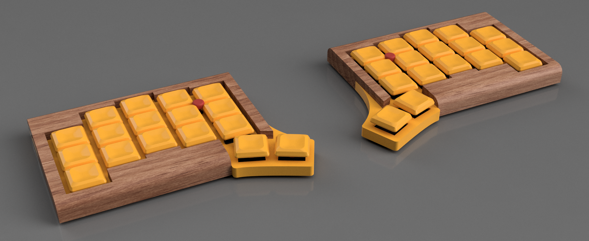
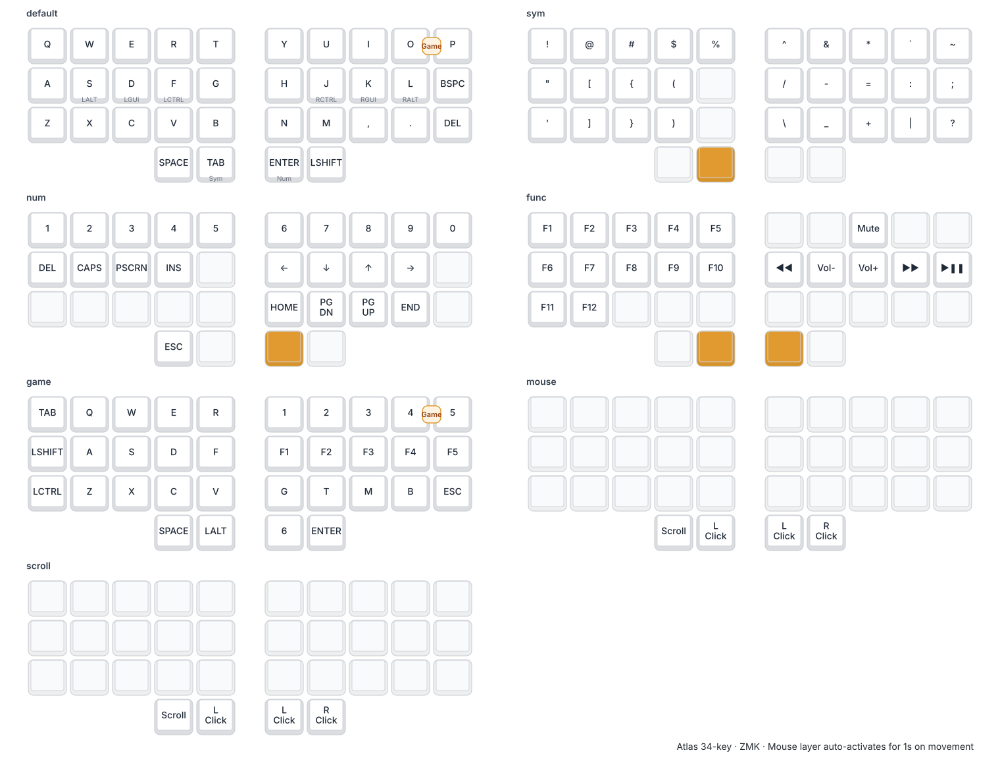

#+TITLE: Atlas Keyboard
#+OPTIONS: toc:nil num:nil

* Atlas
34-key split keyboard with TrackPoint and Trackball, using XIAO BLE controllers and a dongle.

** Status (Jan 2026)
- Left side TrackPoint working (Sprintek all-in-one module)
- Standalone PMW3610 trackball working as third peripheral
- Mouse layer auto-activates on trackpoint/trackball movement
- Scroll mode working

** Architecture
#+begin_example
Dongle (central) <-- Left (trackpoint) + Right (trackpoint) + Trackball (PMW3610)
#+end_example

** Mouse Layer
When moving trackpoint or trackball, the mouse layer auto-activates + 1 second after last movement.

#+begin_example
Thumb keys:
| SCROLL | LCLK | LCLK | RCLK |
#+end_example

- *Scroll*: Hold to convert movement to scroll wheel

** Hardware Notes
- TrackPoint: Still has stability issues with pullup resistors but 
- Trackball: Uses 3-wire SPI (MOSI/MISO shared on D9)

** Build
#+begin_src bash
nix develop
just build all
#+end_src

