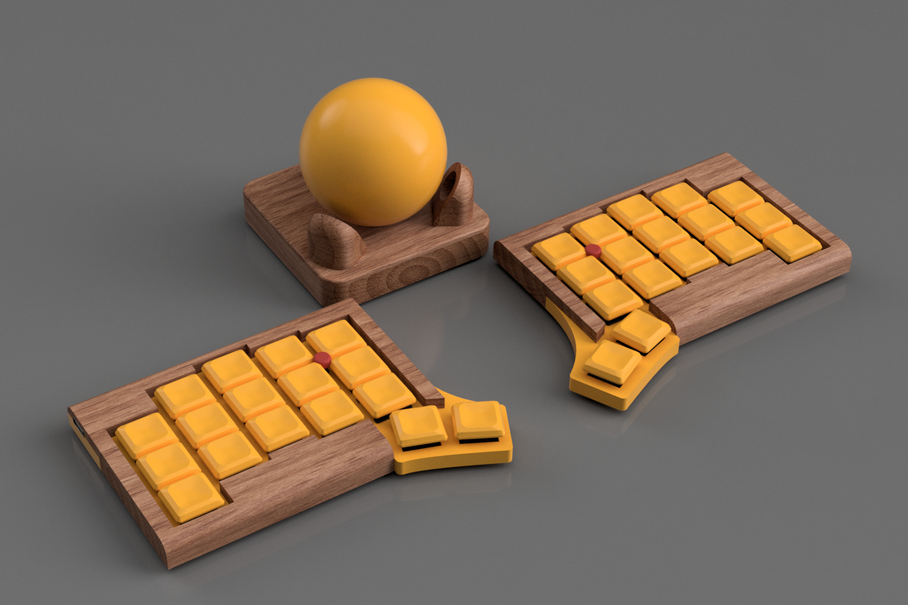
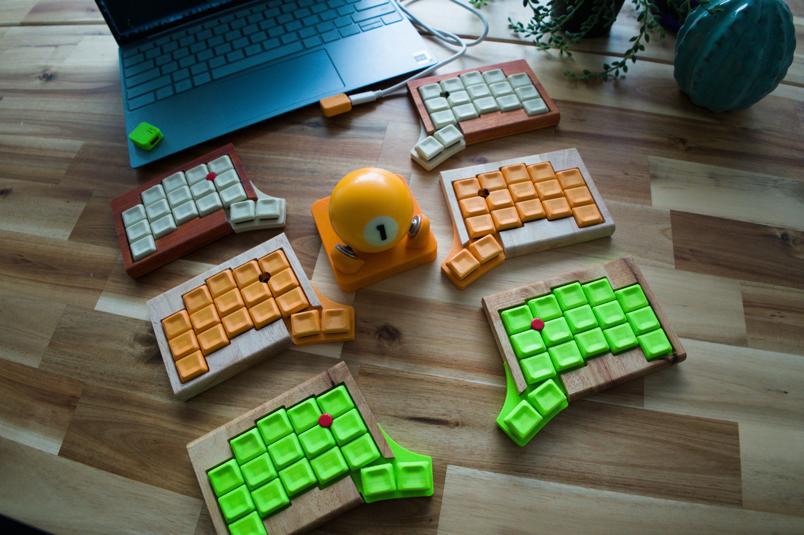
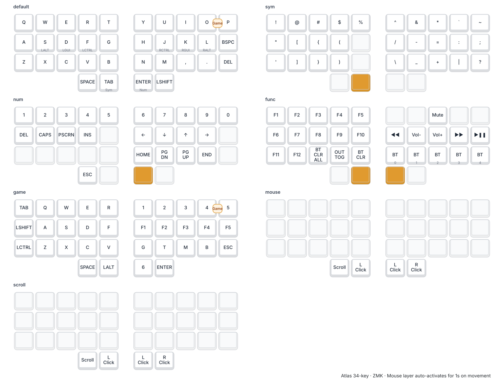

#+title: Atlas
#+options: toc:nil num:nil

* Atlas

Main was reverted to the built, working prototype, commit =426184a=:
soldered Choc V1, 20×17 mm spacing, wider custom caps, and a trackpoint
between the keys. The goal is getting to real production as soon as
possible.

Next step: integrate the new ADC (ADS1220) into this PCB. The later
hotswap/ADS1220 board is in =archive/v2-hotswap-ads1220/= and can be
turned into an extra version later.

The keycaps are not part of the open-source files.

34-key split ergonomic keyboard with a trackpoint on each half and an
optional oversized trackball. XIAO nRF52840, BLE split, ZMK in
=zmk-workspace-ble/=. Board in =pcb/atlas/=, case and plates in =stl/=.

** Architecture

#+begin_example
Host <--BLE-- Left (central + trackpoint) <--BLE-- Right (peripheral + trackpoint)
#+end_example

** Links

- [[https://thock.mwlabs.be][thock.mwlabs.be]] — audition Choc switches.
- [[https://mwlabs.be][mwlabs.be]] — mwlabs.
